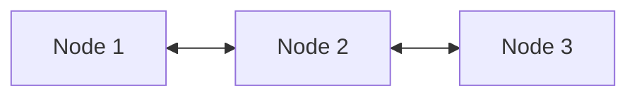
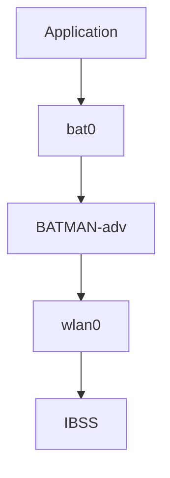
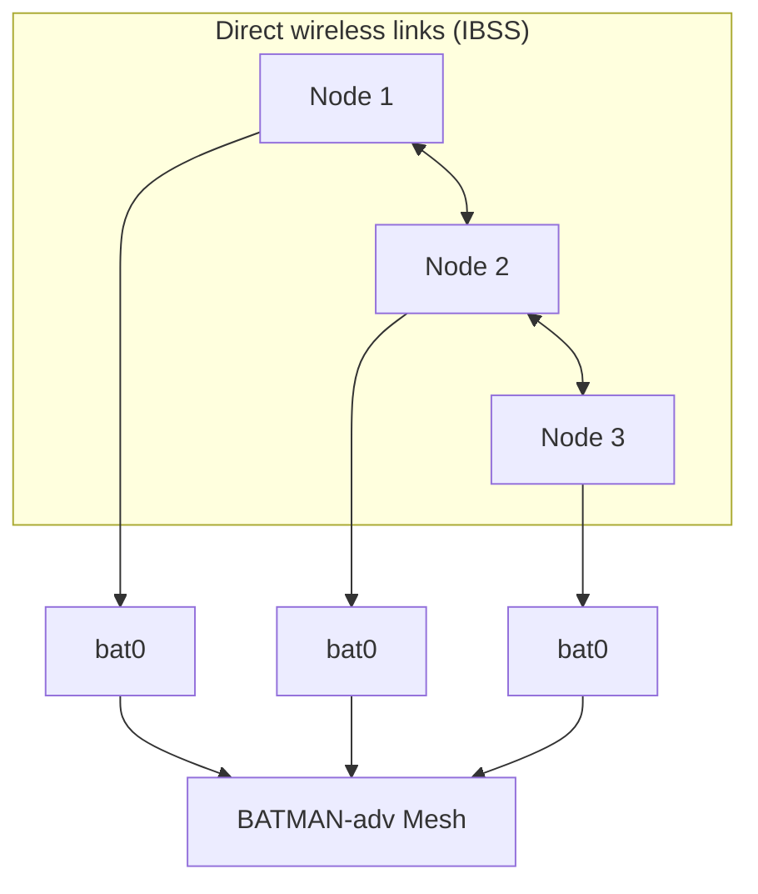
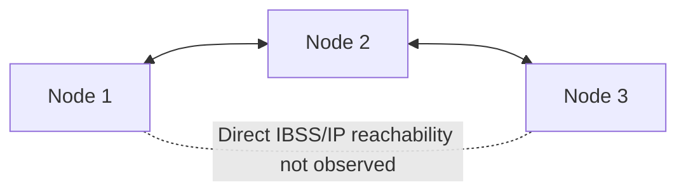

This project explains how to build a wireless mesh network between multiple **T3 Gemstone O1** boards without requiring a central access point.

The wireless interfaces first establish direct peer-to-peer links using **IBSS (ad-hoc mode)**. **BATMAN-adv** then operates on top of these links and provides Layer 2 multi-hop forwarding between nodes.

<Tip>
By the end of this section, you will understand the following topics.

* What a wireless mesh network is
* How IBSS provides direct wireless connectivity
* How BATMAN-adv provides multi-hop forwarding
* How IBSS and BATMAN-adv work together on T3 Gemstone O1
* How the mesh topology was verified using three nodes
</Tip>

## 1. Mesh Networks

A wireless mesh network consists of multiple nodes that can communicate with each other without depending on a central access point.

In a traditional Wi-Fi network, wireless devices normally communicate through an access point. In a mesh network, nodes can establish links with neighboring nodes and traffic can be forwarded through intermediate nodes.

<Tabs>
  <Tab title="Traditional Wi-Fi">
    ```mermaid
    flowchart LR
        N1["Node 1"] --- AP["Access Point"]
        N2["Node 2"] --- AP
        N3["Node 3"] --- AP
    ```
  </Tab>
  <Tab title="Mesh Network">
    ```mermaid
    flowchart LR
        N1["Node 1"] <--> N2["Node 2"]
        N2 <--> N3["Node 3"]
        N3 <--> X["..."]
        X <--> NN["Node N"]
    ```
  </Tab>
</Tabs>

For example, if Node 1 cannot directly communicate with Node 3, Node 2 can act as an intermediate node. This allows the network to extend communication beyond a single direct wireless link.

The mesh architecture described in this project uses two components:

| Component | Role |
| --- | --- |
| **IBSS** | Establishes direct wireless links between neighboring nodes. |
| **BATMAN-adv** | Provides Layer 2 multi-hop forwarding across those links. |

## 2. IBSS

**IBSS (Independent Basic Service Set)** is an IEEE 802.11 ad-hoc operating mode.

Unlike a normal Wi-Fi network, IBSS does not require an access point. Wireless devices join the same IBSS cell and communicate directly with other devices that are within wireless range.

In this project, every T3 Gemstone O1 node joins the same IBSS cell. The shared wireless parameters used in the tested configuration are:

| Parameter | Tested value |
| --- | --- |
| SSID | `gemstone-mesh` |
| Frequency | 2412 MHz |
| Channel | 1 |
| BSSID | `02:12:34:56:78:9a` |

This guide uses `wlan0` on the tested T3 Gemstone O1 boards. On another system, the interface name may differ; the important requirement is to configure a suitable IBSS-capable wireless interface with the same cell parameters.

IBSS provides the direct wireless link between nodes. However, IBSS itself does not provide automatic multi-hop forwarding between nodes that cannot communicate directly.



In this example, Node 1 may communicate directly with Node 2, and Node 2 may communicate directly with Node 3. Without an additional forwarding mechanism, Node 2 does not automatically relay traffic between Node 1 and Node 3.

This is the role of BATMAN-adv.

## 3. BATMAN-adv

**BATMAN-adv** is a Layer 2 mesh networking component implemented in the Linux kernel.

It operates on top of network interfaces such as `wlan0` and creates a virtual mesh interface named `bat0`. The physical wireless interface provides connectivity to neighboring nodes, while BATMAN-adv determines how Ethernet frames should be forwarded through the mesh.



The `bat0` interface is used for communication over the resulting mesh network. The routing algorithm used in this project is `BATMAN_V`.

The following commands are useful for inspecting the mesh:

```bash
sudo batctl n
sudo batctl o
```

`batctl n` displays directly reachable BATMAN-adv neighbors. `batctl o` displays known originators and the selected next hop toward each destination.

## 4. Architecture

IBSS and BATMAN-adv perform different tasks in the network. The applications running on the nodes use the `bat0` interface, while BATMAN-adv handles the forwarding path over the underlying IBSS links.



| Layer | Role in this project |
| --- | --- |
| IBSS | Provides direct wireless connectivity between neighboring nodes. |
| BATMAN-adv | Provides Layer 2 multi-hop forwarding across the IBSS links. |
| `bat0` | Virtual interface used by applications for mesh communication. |

<Note>
This project does not use IEEE 802.11s mesh mode. The wireless interface operates in IBSS mode, and multi-hop forwarding is provided separately by BATMAN-adv.
</Note>

## 5. Tested Configuration

The mesh architecture is not limited to three nodes. Multiple T3 Gemstone O1 boards can participate in the same mesh when they use compatible wireless and BATMAN-adv settings.

The configuration documented in this guide was verified using three boards.

| Component | Tested value |
| --- | --- |
| Board | T3 Gemstone O1 |
| Nodes used for verification | 3 |
| Operating system | Ubuntu 24.04 LTS |
| Architecture | aarch64 |
| Kernel | Linux 6.12.24-ti, PREEMPT_RT |
| Wireless interface | `wlan0` |
| Wireless mode | IBSS |
| SSID | `gemstone-mesh` |
| Frequency | 2412 MHz |
| Channel | 1 |
| BSSID | `02:12:34:56:78:9a` |
| Mesh layer | BATMAN-adv |
| Routing algorithm | `BATMAN_V` |

The three-node verification topology was:



During the captured test, direct IBSS/IP reachability was observed between Node 1 and Node 2 and between Node 3 and Node 2. Direct IBSS/IP reachability between Node 1 and Node 3 was not observed.

After BATMAN-adv was enabled, Node 1 and Node 3 successfully communicated through their `bat0` addresses. The neighbor and originator tables showed Node 2 as the intermediate forwarding node.

The next section explains how to configure the IBSS wireless links and create the BATMAN-adv mesh.
