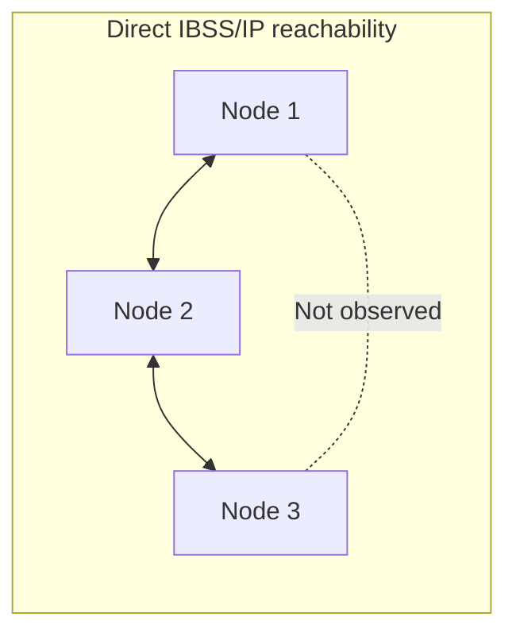
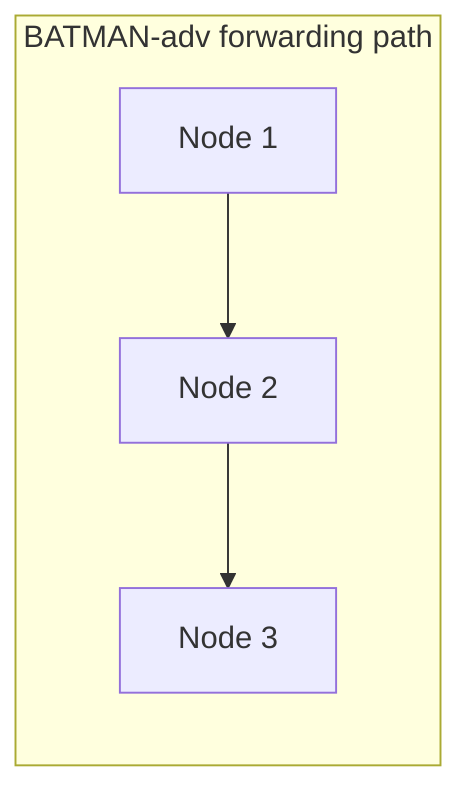
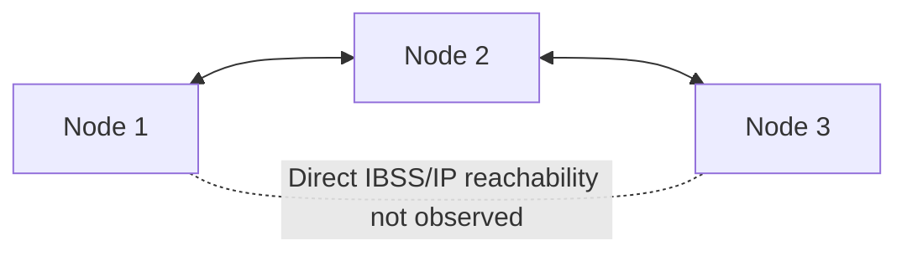
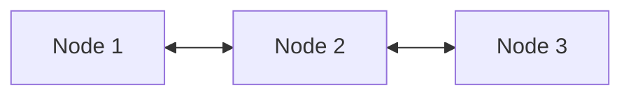
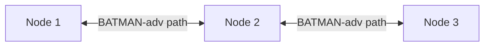

This section verifies the tested three-node topology using the terminal evidence captured during the experiment.

The mesh architecture itself is not limited to three nodes. Three T3 Gemstone O1 boards were used here to demonstrate and verify the multi-hop behavior.

<Tip>
The captured evidence chain checks direct IBSS/IP reachability and mesh communication through BATMAN-adv separately. This makes it possible to verify which intermediate node carried the successful end-to-end ping.
</Tip>

The evidence shows that:

1. Node 1 could reach Node 2 directly over the IBSS subnet.
2. Node 3 could reach Node 2 directly over the IBSS subnet.
3. Direct IBSS/IP reachability between Node 1 and Node 3 was not observed.
4. BATMAN-adv neighbor tables matched the expected three-node topology.
5. BATMAN-adv originator tables selected Node 2 as the next hop between the two edge nodes.
6. After mesh convergence, Node 1 and Node 3 communicated successfully through their `bat0` addresses.

## 1. Test Topology

The test used the following addresses:

| Node | `wlan0` / IBSS | `bat0` / Mesh | `wlan0` MAC |
| --- | --- | --- | --- |
| Node 1 | `192.168.100.1/24` | `192.168.200.1/24` | `b0:8c:b3:c3:75:b6` |
| Node 2 | `192.168.100.2/24` | `192.168.200.2/24` | `b0:8c:b3:c3:83:ea` |
| Node 3 | `192.168.100.3/24` | `192.168.200.3/24` | `b0:8c:b3:c3:77:f8` |

The two subnets have different purposes:

| Subnet | Purpose |
| --- | --- |
| `192.168.100.0/24` | Test direct IBSS/IP reachability |
| `192.168.200.0/24` | Test BATMAN-adv mesh communication through `bat0` |

The decisive test topology was:





## 2. IBSS State

The captured terminal output confirms that the boards joined the same IBSS cell.

Condensed captured output:

<CodeGroup>

  ```bash Command
  iw dev wlan0 link
  ```

  ```bash Output
  Joined IBSS 02:12:34:56:78:9a (on wlan0)
          SSID: gemstone-mesh
          freq: 2412.0
  ```

</CodeGroup>

The interface configuration also showed `wlan0` operating in IBSS mode on channel 1 at 2412 MHz.

| Parameter | Captured value |
| --- | --- |
| Interface | `wlan0` |
| Mode | IBSS |
| SSID | `gemstone-mesh` |
| Frequency | 2412 MHz |
| Channel | 1 |
| BSSID | `02:12:34:56:78:9a` |

## 3. Direct IBSS Evidence

The first test establishes which nodes were directly reachable using the `wlan0` IBSS addresses.

### Node 1

Node 1 could reach Node 2:

<CodeGroup>

  ```bash Command
  ping -c 5 192.168.100.2
  ```

  ```bash Output
  5 packets transmitted, 5 received, 0% packet loss
  ```

</CodeGroup>

Direct IBSS/IP reachability between Node 1 and Node 3 was not observed:

<CodeGroup>

  ```bash Command
  ping -c 5 192.168.100.3
  ```

  ```bash Output
  From 192.168.100.1 icmp_seq=1 Destination Host Unreachable
  From 192.168.100.1 icmp_seq=5 Destination Host Unreachable

  5 packets transmitted, 0 received, +2 errors, 100% packet loss
  ```

</CodeGroup>

### Node 3

The reverse side was also tested. Node 3 could reach Node 2:

<CodeGroup>

  ```bash Command
  ping -c 4 192.168.100.2
  ```

  ```bash Output
  4 packets transmitted, 4 received, 0% packet loss
  ```

</CodeGroup>

Direct IBSS/IP reachability between Node 3 and Node 1 was not observed:

<CodeGroup>

  ```bash Command
  ping -c 4 192.168.100.1
  ```

  ```bash Output
  From 192.168.100.3 icmp_seq=1 Destination Host Unreachable

  4 packets transmitted, 0 received, +1 errors, 100% packet loss
  ```

</CodeGroup>

The direct IBSS evidence therefore establishes the observed edge topology:



<Note>
A failed ping here shows that direct IBSS/IP reachability was not observed. By itself, it should not be interpreted as absolute proof that no physical radio link exists; it is evaluated together with the following BATMAN-adv neighbor and originator tables.
</Note>

## 4. BATMAN-adv Neighbors

After the direct topology was established, BATMAN-adv was enabled on all three boards.

| Setting | Tested value |
| --- | --- |
| Routing algorithm | `BATMAN_V` |
| Mesh interface | `bat0` |

### Node 1

The captured neighbor table contained only Node 2:

<CodeGroup>

  ```bash Command
  sudo batctl n
  ```

  ```bash Output
  Neighbor
  b0:8c:b3:c3:83:ea
  ```

</CodeGroup>

### Node 2

The captured neighbor table contained both edge nodes:

<CodeGroup>

  ```bash Command
  sudo batctl n
  ```

  ```bash Output
  Neighbor
  b0:8c:b3:c3:77:f8
  b0:8c:b3:c3:75:b6
  ```

</CodeGroup>

### Node 3

The captured neighbor table contained Node 2:

<CodeGroup>

  ```bash Command
  sudo batctl n
  ```

  ```bash Output
  Neighbor
  b0:8c:b3:c3:83:ea
  ```

</CodeGroup>

The MAC mapping from the test was:

| MAC | Node |
| --- | --- |
| `b0:8c:b3:c3:75:b6` | Node 1 |
| `b0:8c:b3:c3:83:ea` | Node 2 |
| `b0:8c:b3:c3:77:f8` | Node 3 |

The BATMAN-adv neighbor tables therefore match:



## 5. Forwarding Path

A successful endpoint ping alone is not sufficient to identify the forwarding path. For this reason, the BATMAN-adv originator table was also inspected.

### Node 1 to Node 3

Condensed relevant entries captured on Node 1:

<CodeGroup>

  ```bash Command
  sudo batctl o
  ```

  ```bash Output
  Originator              Nexthop
  b0:8c:b3:c3:77:f8      b0:8c:b3:c3:83:ea
  b0:8c:b3:c3:83:ea      b0:8c:b3:c3:83:ea
  ```

</CodeGroup>

Using the tested MAC mapping:

| Originator | Selected next hop | Meaning |
| --- | --- | --- |
| `b0:8c:b3:c3:77:f8` | `b0:8c:b3:c3:83:ea` | Node 3 is reached through Node 2. |
| `b0:8c:b3:c3:83:ea` | `b0:8c:b3:c3:83:ea` | Node 2 is the direct next hop. |

### Node 3 to Node 1

Condensed relevant entries captured on Node 3:

<CodeGroup>

  ```bash Command
  sudo batctl o
  ```

  ```bash Output
  Originator              Nexthop
  b0:8c:b3:c3:75:b6      b0:8c:b3:c3:83:ea
  b0:8c:b3:c3:83:ea      b0:8c:b3:c3:83:ea
  ```

</CodeGroup>

Using the tested MAC mapping:

| Originator | Selected next hop | Meaning |
| --- | --- | --- |
| `b0:8c:b3:c3:75:b6` | `b0:8c:b3:c3:83:ea` | Node 1 is reached through Node 2. |
| `b0:8c:b3:c3:83:ea` | `b0:8c:b3:c3:83:ea` | Node 2 is the direct next hop. |

The originator tables provide direct routing evidence that the remote edge node is reached through Node 2.

## 6. End-to-End Mesh Evidence

The final test uses the `bat0` addresses rather than the direct IBSS addresses.

A short convergence interval was observed after BATMAN-adv startup. Initial `bat0` ping attempts could fail while neighbor and originator information was still being learned. After the tables stabilized, the final captured tests succeeded in both directions.

### Node 1 to Node 3

An initial attempt before convergence produced:

<CodeGroup>

  ```bash Command
  ping -c 5 192.168.200.3
  ```

  ```bash Output
  5 packets transmitted, 0 received, 100% packet loss
  ```

</CodeGroup>

After mesh convergence, the final captured result was:

<CodeGroup>

  ```bash Command
  ping -c 5 192.168.200.3
  ```

  ```bash Output
  5 packets transmitted, 5 received, 0% packet loss
  ```

</CodeGroup>

### Node 3 to Node 1

An initial attempt before convergence produced:

<CodeGroup>

  ```bash Command
  ping -c 4 192.168.200.1
  ```

  ```bash Output
  4 packets transmitted, 0 received, 100% packet loss
  ```

</CodeGroup>

After mesh convergence, the final captured result was:

<CodeGroup>

  ```bash Command
  ping -c 4 192.168.200.1
  ```

  ```bash Output
  4 packets transmitted, 4 received, 0% packet loss
  ```

</CodeGroup>

Comparing the direct IBSS and `bat0` tests:

| Test | Captured result |
| --- | --- |
| Node 1 → `192.168.100.3` | `100% packet loss` |
| Node 1 → `192.168.200.3` | `0% packet loss` |
| Node 3 → `192.168.100.1` | `100% packet loss` |
| Node 3 → `192.168.200.1` | `0% packet loss` |

## 7. Result

The captured evidence can be summarized as follows:

| Verification | Captured result |
| --- | --- |
| Node 1 → Node 2 over IBSS | `0% packet loss` |
| Node 1 → Node 3 over IBSS | `100% packet loss` |
| Node 3 → Node 2 over IBSS | `0% packet loss` |
| Node 3 → Node 1 over IBSS | `100% packet loss` |
| Node 1 direct BATMAN-adv neighbor | Node 2 |
| Node 2 direct BATMAN-adv neighbors | Node 1 and Node 3 |
| Node 3 direct BATMAN-adv neighbor | Node 2 |
| Node 1 → Node 3 selected next hop | Node 2 |
| Node 3 → Node 1 selected next hop | Node 2 |
| Node 1 → Node 3 over `bat0` after convergence | `0% packet loss` |
| Node 3 → Node 1 over `bat0` after convergence | `0% packet loss` |

The verified forwarding path is:



The failed direct edge-to-edge IBSS pings, successful direct communication with Node 2 from both sides, BATMAN-adv neighbor tables, originator/next-hop information, and successful bidirectional `bat0` pings together demonstrate multi-hop Layer 2 forwarding through Node 2 in the tested topology.

## 8. Additional Checks

The following commands can be used for additional mesh diagnostics. They are useful for further verification, but their results are not part of the captured evidence summarized above.

Trace the BATMAN-adv path toward a remote originator:

```bash
sudo batctl tr <REMOTE_ORIGINATOR_MAC>
```

Use BATMAN-adv's own ping mechanism:

```bash
sudo batctl ping <REMOTE_ORIGINATOR_MAC>
```

Inspect forwarding-related statistics:

```bash
sudo batctl s | grep -E "^\s+forward"
```

Observe BATMAN-adv Ethernet frames:

```bash
sudo tcpdump -i wlan0 -n -e ether proto 0x4305
```

These checks are optional and are not required to reproduce the captured verification chain above.
