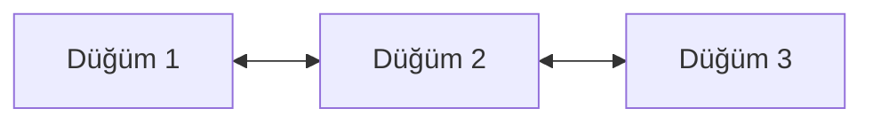
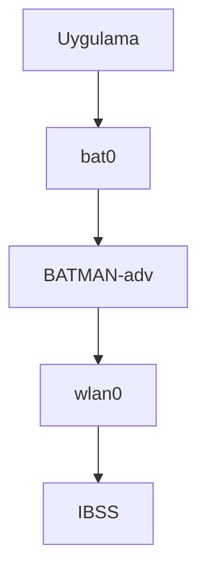
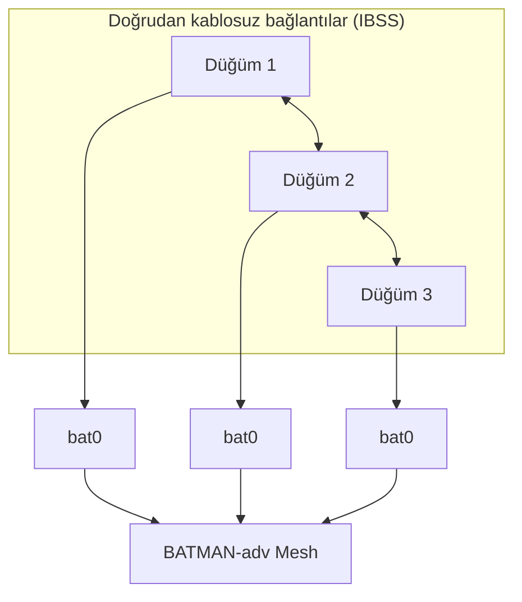
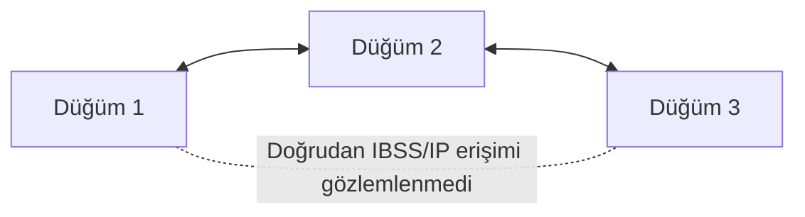

Bu proje, merkezi bir erişim noktasına ihtiyaç duymadan birden fazla **T3 Gemstone O1** kartı arasında kablosuz mesh ağ oluşturmayı açıklamaktadır.

Kablosuz arayüzler önce **IBSS (ad-hoc mod)** kullanarak doğrudan eşler arası bağlantılar kurar. Ardından **BATMAN-adv**, bu bağlantıların üzerinde çalışarak düğümler arasında Katman 2 seviyesinde çok atlamalı veri iletimi sağlar.

<Tip>
Bu bölümün sonunda aşağıdaki konularda bilgi sahibi olacaksınız.

* Kablosuz mesh ağın ne olduğu
* IBSS'in doğrudan kablosuz bağlantıyı nasıl sağladığı
* BATMAN-adv'in çok atlamalı veri iletimini nasıl sağladığı
* IBSS ve BATMAN-adv'in T3 Gemstone O1 üzerinde birlikte nasıl çalıştığı
* Mesh topolojisinin üç düğümlü bir testle nasıl doğrulandığı
</Tip>

## 1. Mesh Ağlar

Kablosuz mesh ağ, merkezi bir erişim noktasına bağlı olmadan birbirleriyle iletişim kurabilen birden fazla düğümden oluşur.

Geleneksel bir Wi-Fi ağında kablosuz cihazlar genellikle bir erişim noktası üzerinden iletişim kurar. Mesh ağda ise düğümler komşu düğümlerle doğrudan bağlantı kurabilir ve trafik ara düğümler üzerinden iletilebilir.

<Tabs>
  <Tab title="Geleneksel Wi-Fi">
    ```mermaid
    flowchart LR
        D1["Düğüm 1"] --- AP["Erişim Noktası"]
        D2["Düğüm 2"] --- AP
        D3["Düğüm 3"] --- AP
    ```
  </Tab>
  <Tab title="Mesh Ağ">
    ```mermaid
    flowchart LR
        D1["Düğüm 1"] <--> D2["Düğüm 2"]
        D2 <--> D3["Düğüm 3"]
        D3 <--> X["..."]
        X <--> DN["Düğüm N"]
    ```
  </Tab>
</Tabs>

Örneğin Düğüm 1, Düğüm 3 ile doğrudan iletişim kuramıyorsa Düğüm 2 ara düğüm olarak kullanılabilir. Bu sayede ağ, tek bir doğrudan kablosuz bağlantının kapsama alanının ötesine iletişim sağlayabilir.

Bu projede kullanılan mesh mimarisi iki bileşenden oluşur:

| Bileşen | Görev |
| --- | --- |
| **IBSS** | Komşu düğümler arasında doğrudan kablosuz bağlantı kurar. |
| **BATMAN-adv** | Bu bağlantılar üzerinden Katman 2 seviyesinde çok atlamalı veri iletimi sağlar. |

## 2. IBSS

**IBSS (Independent Basic Service Set)**, IEEE 802.11 standardındaki ad-hoc çalışma modudur.

Normal bir Wi-Fi ağından farklı olarak IBSS bir erişim noktası gerektirmez. Kablosuz cihazlar aynı IBSS hücresine katılır ve kablosuz kapsama alanındaki diğer cihazlarla doğrudan iletişim kurar.

Bu projede her T3 Gemstone O1 düğümü aynı IBSS hücresine katılır. Test edilen yapılandırmada kullanılan ortak kablosuz parametreler şunlardır:

| Parametre | Test edilen değer |
| --- | --- |
| SSID | `gemstone-mesh` |
| Frekans | 2412 MHz |
| Kanal | 1 |
| BSSID | `02:12:34:56:78:9a` |

Bu rehberde test edilen T3 Gemstone O1 kartlarında kablosuz arayüz olarak `wlan0` kullanılmıştır. Farklı bir sistemde arayüz adı değişebilir; önemli olan IBSS'i destekleyen uygun kablosuz arayüzün aynı hücre parametreleriyle yapılandırılmasıdır.

IBSS, düğümler arasındaki doğrudan kablosuz bağlantıyı sağlar. Ancak doğrudan iletişim kuramayan düğümler arasında otomatik çok atlamalı veri iletimi sağlamaz.



Bu örnekte Düğüm 1, Düğüm 2 ile; Düğüm 2 ise Düğüm 3 ile doğrudan iletişim kurabilir. Ek bir iletim mekanizması olmadan Düğüm 2, Düğüm 1 ile Düğüm 3 arasındaki trafiği otomatik olarak aktarmaya başlamaz.

Bu görevi BATMAN-adv üstlenir.

## 3. BATMAN-adv

**BATMAN-adv**, Linux kernel içinde çalışan Katman 2 seviyesinde bir mesh ağ bileşenidir.

`wlan0` gibi ağ arayüzlerinin üzerinde çalışır ve `bat0` adında sanal bir mesh arayüzü oluşturur. Fiziksel kablosuz arayüz komşu düğümlere bağlantı sağlarken BATMAN-adv, Ethernet çerçevelerinin mesh ağ üzerinden hangi yol ile iletileceğini belirler.



Oluşan mesh ağ üzerinden iletişim için `bat0` arayüzü kullanılır. Bu projede kullanılan yönlendirme algoritması `BATMAN_V` değeridir.

Mesh durumunu incelemek için özellikle şu komutlar kullanılır:

```bash
sudo batctl n
sudo batctl o
```

`batctl n`, doğrudan erişilebilen BATMAN-adv komşularını gösterir. `batctl o`, bilinen originator düğümleri ve her hedefe doğru seçilen sonraki atlamayı gösterir.

## 4. Mimari

IBSS ve BATMAN-adv ağ içinde farklı görevler üstlenir. Düğümler üzerinde çalışan uygulamalar `bat0` arayüzünü kullanır; alttaki IBSS bağlantıları üzerindeki iletim yolunu BATMAN-adv yönetir.



| Katman | Bu projedeki rolü |
| --- | --- |
| IBSS | Komşu düğümler arasında doğrudan kablosuz bağlantı sağlar. |
| BATMAN-adv | IBSS bağlantıları üzerinden Katman 2 çok atlamalı veri iletimi sağlar. |
| `bat0` | Uygulamaların mesh iletişimi için kullandığı sanal arayüzdür. |

<Note>
Bu proje IEEE 802.11s mesh modunu kullanmaz. Kablosuz arayüz IBSS modunda çalışır ve çok atlamalı veri iletimi ayrı olarak BATMAN-adv tarafından sağlanır.
</Note>

## 5. Test Edilen Yapılandırma

Mesh mimarisi üç düğümle sınırlı değildir. Uyumlu kablosuz ve BATMAN-adv ayarlarını kullanan birden fazla T3 Gemstone O1 kartı aynı mesh ağa katılabilir.

Bu dokümanda açıklanan yapılandırma üç kart kullanılarak doğrulanmıştır.

| Bileşen | Test edilen değer |
| --- | --- |
| Kart | T3 Gemstone O1 |
| Doğrulamada kullanılan düğüm sayısı | 3 |
| İşletim sistemi | Ubuntu 24.04 LTS |
| Mimari | aarch64 |
| Kernel | Linux 6.12.24-ti, PREEMPT_RT |
| Kablosuz arayüz | `wlan0` |
| Kablosuz mod | IBSS |
| SSID | `gemstone-mesh` |
| Frekans | 2412 MHz |
| Kanal | 1 |
| BSSID | `02:12:34:56:78:9a` |
| Mesh katmanı | BATMAN-adv |
| Yönlendirme algoritması | `BATMAN_V` |

Üç düğümlü doğrulama topolojisi:



Kaydedilen testte Düğüm 1 ile Düğüm 2 ve Düğüm 3 ile Düğüm 2 arasında doğrudan IBSS/IP erişimi gözlemlenmiştir. Düğüm 1 ile Düğüm 3 arasında ise doğrudan IBSS/IP erişimi gözlemlenmemiştir.

BATMAN-adv etkinleştirildikten sonra Düğüm 1 ile Düğüm 3, `bat0` adresleri üzerinden başarılı şekilde iletişim kurmuştur. Komşu ve originator tabloları Düğüm 2'nin ara iletim düğümü olduğunu göstermiştir.

Bir sonraki bölümde IBSS kablosuz bağlantılarının nasıl yapılandırılacağı ve BATMAN-adv mesh katmanının nasıl oluşturulacağı açıklanmaktadır.
