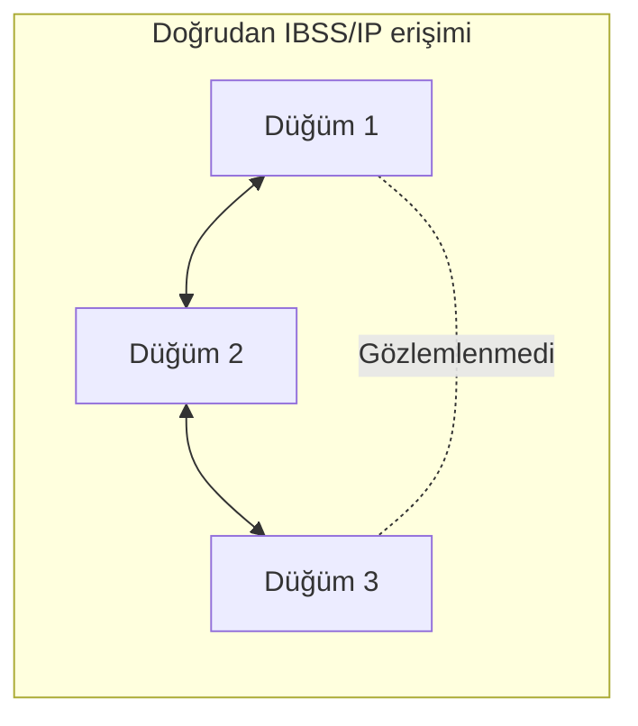
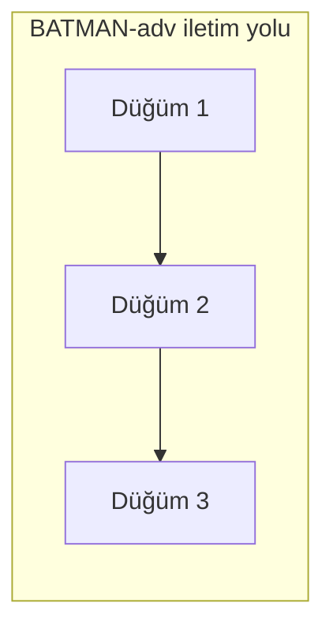
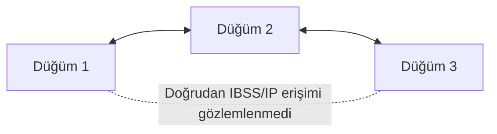
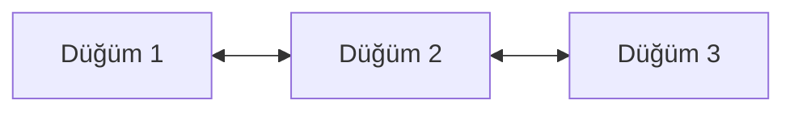
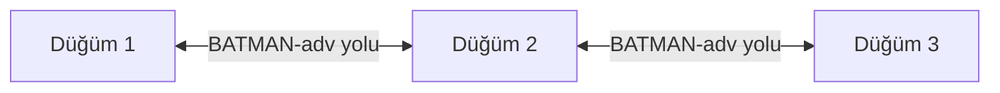

Bu bölümde test edilen üç düğümlü topoloji, deney sırasında kaydedilen terminal çıktıları kullanılarak doğrulanmaktadır.

Mesh mimarisi üç düğümle sınırlı değildir. Burada çok atlamalı davranışı göstermek ve doğrulamak için üç T3 Gemstone O1 kartı kullanılmıştır.

<Tip>
Kaydedilen kanıt zinciri, doğrudan IBSS/IP erişimi ile BATMAN-adv üzerinden mesh iletişimini ayrı ayrı inceler. Böylece başarılı bir uçtan uca ping sonucunun hangi ara düğüm üzerinden gerçekleştiği de doğrulanabilir.
</Tip>

Kanıtlar şunları göstermektedir:

1. Düğüm 1, IBSS ağı üzerinden Düğüm 2'ye doğrudan erişebilmiştir.
2. Düğüm 3, IBSS ağı üzerinden Düğüm 2'ye doğrudan erişebilmiştir.
3. Düğüm 1 ile Düğüm 3 arasında doğrudan IBSS/IP erişimi gözlemlenmemiştir.
4. BATMAN-adv komşuluk tabloları beklenen üç düğümlü topolojiyle eşleşmiştir.
5. BATMAN-adv originator tabloları iki uç düğüm arasında sonraki atlama olarak Düğüm 2'yi seçmiştir.
6. Mesh yakınsamasından sonra Düğüm 1 ile Düğüm 3, `bat0` adresleri üzerinden başarılı şekilde iletişim kurmuştur.

## 1. Test Topolojisi

Testte aşağıdaki adresler kullanılmıştır:

| Düğüm | `wlan0` / IBSS | `bat0` / Mesh | `wlan0` MAC |
| --- | --- | --- | --- |
| Düğüm 1 | `192.168.100.1/24` | `192.168.200.1/24` | `b0:8c:b3:c3:75:b6` |
| Düğüm 2 | `192.168.100.2/24` | `192.168.200.2/24` | `b0:8c:b3:c3:83:ea` |
| Düğüm 3 | `192.168.100.3/24` | `192.168.200.3/24` | `b0:8c:b3:c3:77:f8` |

İki ağ farklı amaçlarla kullanılmıştır:

| Ağ | Amaç |
| --- | --- |
| `192.168.100.0/24` | Doğrudan IBSS/IP erişimini test etmek |
| `192.168.200.0/24` | `bat0` üzerinden BATMAN-adv mesh iletişimini test etmek |

Belirleyici test topolojisi:





## 2. IBSS Durumu

Kaydedilen terminal çıktıları kartların aynı IBSS hücresine katıldığını doğrulamaktadır.

Sadeleştirilmiş kaydedilen çıktı:

<CodeGroup>

  ```bash Komut
  iw dev wlan0 link
  ```

  ```bash Çıktı
  Joined IBSS 02:12:34:56:78:9a (on wlan0)
          SSID: gemstone-mesh
          freq: 2412.0
  ```

</CodeGroup>

Arayüz yapılandırmasında `wlan0` arayüzünün 2412 MHz kanal 1 üzerinde IBSS modunda çalıştığı da görülmüştür.

| Parametre | Kaydedilen değer |
| --- | --- |
| Arayüz | `wlan0` |
| Mod | IBSS |
| SSID | `gemstone-mesh` |
| Frekans | 2412 MHz |
| Kanal | 1 |
| BSSID | `02:12:34:56:78:9a` |

## 3. Doğrudan IBSS Kanıtı

İlk testte `wlan0` IBSS adresleri kullanılarak hangi düğümlerin doğrudan erişilebilir olduğu belirlenmiştir.

### Düğüm 1

Düğüm 1, Düğüm 2'ye erişebilmiştir:

<CodeGroup>

  ```bash Komut
  ping -c 5 192.168.100.2
  ```

  ```bash Çıktı
  5 packets transmitted, 5 received, 0% packet loss
  ```

</CodeGroup>

Düğüm 1 ile Düğüm 3 arasında doğrudan IBSS/IP erişimi gözlemlenmemiştir:

<CodeGroup>

  ```bash Komut
  ping -c 5 192.168.100.3
  ```

  ```bash Çıktı
  From 192.168.100.1 icmp_seq=1 Destination Host Unreachable
  From 192.168.100.1 icmp_seq=5 Destination Host Unreachable

  5 packets transmitted, 0 received, +2 errors, 100% packet loss
  ```

</CodeGroup>

### Düğüm 3

Ters taraf da test edilmiştir. Düğüm 3, Düğüm 2'ye erişebilmiştir:

<CodeGroup>

  ```bash Komut
  ping -c 4 192.168.100.2
  ```

  ```bash Çıktı
  4 packets transmitted, 4 received, 0% packet loss
  ```

</CodeGroup>

Düğüm 3 ile Düğüm 1 arasında doğrudan IBSS/IP erişimi gözlemlenmemiştir:

<CodeGroup>

  ```bash Komut
  ping -c 4 192.168.100.1
  ```

  ```bash Çıktı
  From 192.168.100.3 icmp_seq=1 Destination Host Unreachable

  4 packets transmitted, 0 received, +1 errors, 100% packet loss
  ```

</CodeGroup>

Doğrudan IBSS kanıtı şu gözlemlenen topolojiyi ortaya koymaktadır:



<Note>
Başarısız ping sonucu burada doğrudan IBSS/IP erişiminin gözlemlenmediğini gösterir. Bu sonuç tek başına fiziksel radyo bağının mutlak olarak bulunmadığı anlamına gelmez; sonraki BATMAN-adv komşuluk ve originator tabloları ile birlikte değerlendirilir.
</Note>

## 4. BATMAN-adv Komşuları

Doğrudan topoloji belirlendikten sonra üç kartta da BATMAN-adv etkinleştirilmiştir.

| Ayar | Test edilen değer |
| --- | --- |
| Yönlendirme algoritması | `BATMAN_V` |
| Mesh arayüzü | `bat0` |

### Düğüm 1

Kaydedilen komşuluk tablosunda yalnızca Düğüm 2 bulunmaktadır:

<CodeGroup>

  ```bash Komut
  sudo batctl n
  ```

  ```bash Çıktı
  Neighbor
  b0:8c:b3:c3:83:ea
  ```

</CodeGroup>

### Düğüm 2

Kaydedilen komşuluk tablosunda iki uç düğüm de bulunmaktadır:

<CodeGroup>

  ```bash Komut
  sudo batctl n
  ```

  ```bash Çıktı
  Neighbor
  b0:8c:b3:c3:77:f8
  b0:8c:b3:c3:75:b6
  ```

</CodeGroup>

### Düğüm 3

Kaydedilen komşuluk tablosunda Düğüm 2 bulunmaktadır:

<CodeGroup>

  ```bash Komut
  sudo batctl n
  ```

  ```bash Çıktı
  Neighbor
  b0:8c:b3:c3:83:ea
  ```

</CodeGroup>

Testteki MAC eşleşmeleri:

| MAC | Düğüm |
| --- | --- |
| `b0:8c:b3:c3:75:b6` | Düğüm 1 |
| `b0:8c:b3:c3:83:ea` | Düğüm 2 |
| `b0:8c:b3:c3:77:f8` | Düğüm 3 |

BATMAN-adv komşuluk tabloları şu yapıyla eşleşmektedir:



## 5. İletim Yolu

Yalnızca başarılı bir uçtan uca ping, iletim yolunu belirlemek için yeterli değildir. Bu nedenle BATMAN-adv originator tablosu da incelenmiştir.

### Düğüm 1'den Düğüm 3'e

Düğüm 1 üzerinde kaydedilen sadeleştirilmiş ilgili satırlar:

<CodeGroup>

  ```bash Komut
  sudo batctl o
  ```

  ```bash Çıktı
  Originator              Nexthop
  b0:8c:b3:c3:77:f8      b0:8c:b3:c3:83:ea
  b0:8c:b3:c3:83:ea      b0:8c:b3:c3:83:ea
  ```

</CodeGroup>

Testteki MAC eşleşmelerine göre:

| Originator | Seçilen sonraki atlama | Anlamı |
| --- | --- | --- |
| `b0:8c:b3:c3:77:f8` | `b0:8c:b3:c3:83:ea` | Düğüm 3'e Düğüm 2 üzerinden gidilir. |
| `b0:8c:b3:c3:83:ea` | `b0:8c:b3:c3:83:ea` | Düğüm 2 doğrudan sonraki atlamadır. |

### Düğüm 3'ten Düğüm 1'e

Düğüm 3 üzerinde kaydedilen sadeleştirilmiş ilgili satırlar:

<CodeGroup>

  ```bash Komut
  sudo batctl o
  ```

  ```bash Çıktı
  Originator              Nexthop
  b0:8c:b3:c3:75:b6      b0:8c:b3:c3:83:ea
  b0:8c:b3:c3:83:ea      b0:8c:b3:c3:83:ea
  ```

</CodeGroup>

Testteki MAC eşleşmelerine göre:

| Originator | Seçilen sonraki atlama | Anlamı |
| --- | --- | --- |
| `b0:8c:b3:c3:75:b6` | `b0:8c:b3:c3:83:ea` | Düğüm 1'e Düğüm 2 üzerinden gidilir. |
| `b0:8c:b3:c3:83:ea` | `b0:8c:b3:c3:83:ea` | Düğüm 2 doğrudan sonraki atlamadır. |

Originator tabloları, uzak uç düğüme Düğüm 2 üzerinden ulaşıldığına dair doğrudan yönlendirme kanıtı sağlar.

## 6. Uçtan Uca Mesh Kanıtı

Son testte doğrudan IBSS adresleri yerine `bat0` adresleri kullanılmıştır.

BATMAN-adv başlatıldıktan sonra kısa bir yakınsama süresi gözlemlenmiştir. Komşuluk ve originator bilgileri henüz öğrenilirken ilk `bat0` ping denemeleri başarısız olabilmiş, tablolar kararlı hale geldikten sonra nihai testler iki yönde de başarılı olmuştur.

### Düğüm 1'den Düğüm 3'e

Yakınsama öncesindeki ilk denemede:

<CodeGroup>

  ```bash Komut
  ping -c 5 192.168.200.3
  ```

  ```bash Çıktı
  5 packets transmitted, 0 received, 100% packet loss
  ```

</CodeGroup>

Mesh yakınsamasından sonra kaydedilen nihai sonuç:

<CodeGroup>

  ```bash Komut
  ping -c 5 192.168.200.3
  ```

  ```bash Çıktı
  5 packets transmitted, 5 received, 0% packet loss
  ```

</CodeGroup>

### Düğüm 3'ten Düğüm 1'e

Yakınsama öncesindeki ilk denemede:

<CodeGroup>

  ```bash Komut
  ping -c 4 192.168.200.1
  ```

  ```bash Çıktı
  4 packets transmitted, 0 received, 100% packet loss
  ```

</CodeGroup>

Mesh yakınsamasından sonra kaydedilen nihai sonuç:

<CodeGroup>

  ```bash Komut
  ping -c 4 192.168.200.1
  ```

  ```bash Çıktı
  4 packets transmitted, 4 received, 0% packet loss
  ```

</CodeGroup>

Doğrudan IBSS ve `bat0` testleri birlikte değerlendirildiğinde:

| Test | Kaydedilen sonuç |
| --- | --- |
| Düğüm 1 → `192.168.100.3` | `%100 packet loss` |
| Düğüm 1 → `192.168.200.3` | `%0 packet loss` |
| Düğüm 3 → `192.168.100.1` | `%100 packet loss` |
| Düğüm 3 → `192.168.200.1` | `%0 packet loss` |

## 7. Sonuç

Kaydedilen kanıtlar şu şekilde özetlenebilir:

| Doğrulama | Kaydedilen sonuç |
| --- | --- |
| Düğüm 1 → Düğüm 2, IBSS | `%0 packet loss` |
| Düğüm 1 → Düğüm 3, IBSS | `%100 packet loss` |
| Düğüm 3 → Düğüm 2, IBSS | `%0 packet loss` |
| Düğüm 3 → Düğüm 1, IBSS | `%100 packet loss` |
| Düğüm 1 doğrudan BATMAN-adv komşusu | Düğüm 2 |
| Düğüm 2 doğrudan BATMAN-adv komşuları | Düğüm 1 ve Düğüm 3 |
| Düğüm 3 doğrudan BATMAN-adv komşusu | Düğüm 2 |
| Düğüm 1 → Düğüm 3 seçilen next-hop | Düğüm 2 |
| Düğüm 3 → Düğüm 1 seçilen next-hop | Düğüm 2 |
| Düğüm 1 → Düğüm 3, `bat0`, yakınsama sonrası | `%0 packet loss` |
| Düğüm 3 → Düğüm 1, `bat0`, yakınsama sonrası | `%0 packet loss` |

Doğrulanan iletim yolu:



Uç düğümler arasındaki doğrudan IBSS pinglerinin başarısız olması, her iki uç düğümün Düğüm 2 ile doğrudan iletişim kurabilmesi, BATMAN-adv komşuluk tabloları, originator/next-hop bilgisi ve iki yönlü başarılı `bat0` pingleri birlikte değerlendirildiğinde, test edilen topolojide Düğüm 2 üzerinden çok atlamalı Katman 2 veri iletiminin çalıştığı doğrulanmaktadır.

## 8. Ek Kontroller

Aşağıdaki komutlar ek mesh teşhisi için kullanılabilir. Bu kontroller yararlıdır ancak sonuçları yukarıdaki kaydedilmiş kanıt zincirinin bir parçası olarak sunulmamaktadır.

Uzak originator'a doğru BATMAN-adv yolunu incelemek için:

```bash
sudo batctl tr <REMOTE_ORIGINATOR_MAC>
```

BATMAN-adv'in kendi ping mekanizmasını kullanmak için:

```bash
sudo batctl ping <REMOTE_ORIGINATOR_MAC>
```

İletimle ilgili istatistikleri incelemek için:

```bash
sudo batctl s | grep -E "^\s+forward"
```

BATMAN-adv Ethernet çerçevelerini gözlemlemek için:

```bash
sudo tcpdump -i wlan0 -n -e ether proto 0x4305
```

Bu kontroller isteğe bağlıdır ve yukarıdaki kaydedilmiş doğrulama zincirini yeniden üretmek için zorunlu değildir.
